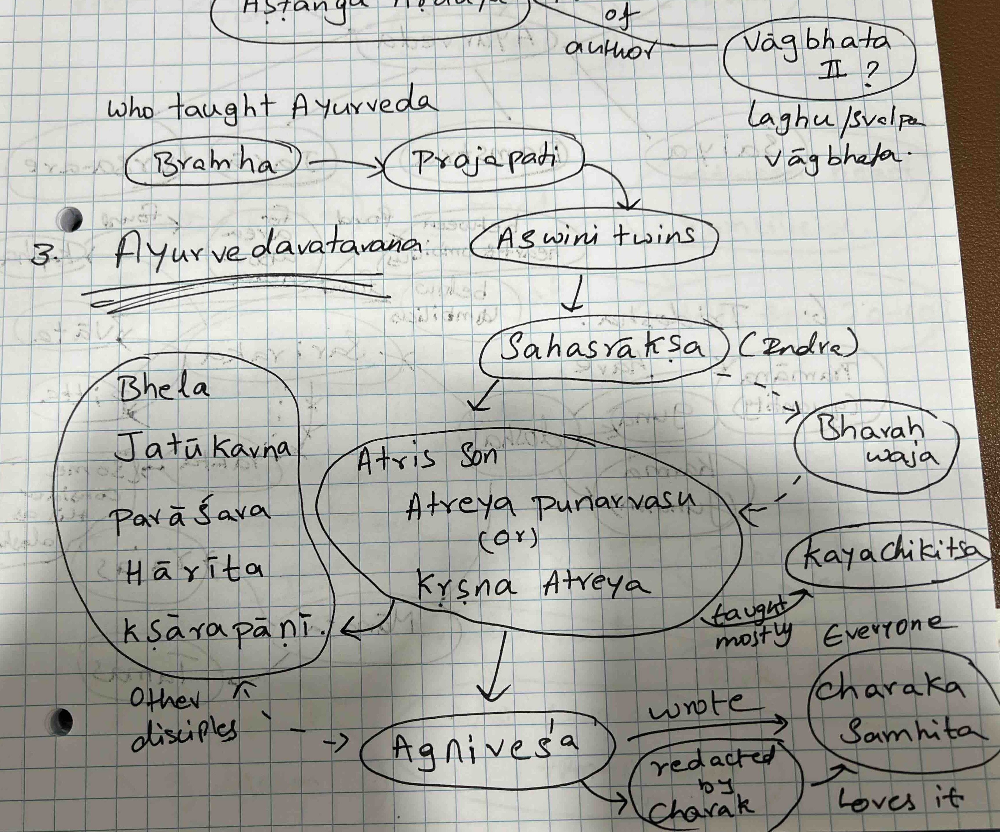
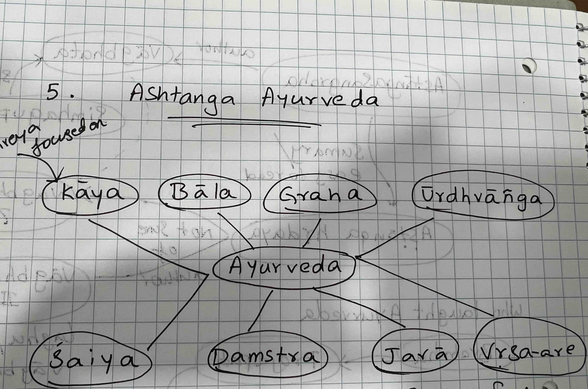

# Suthrasthana

#ayurveda

First chapter of [[AshtangaHrydayam]] talks about [[Ayurvedam]]

## Chapter 1

### Ayurvedavataranam

<!--  -->

- Bramha -> prajapathi -> Ashwinis -> sahasraksha -> bharadvaja -> Atreya
- Atreya taught it to Bhela, Jatukavna, parasara, harita, kshaarapaanii, [[Agnivesa]]
  - Each one of them wrote a treatise and presented [[Atreya]]
  - Best of them was [[Agnivesa]] and it became popular in the work.
- Atreya wrote [[charaka_samhitha]]
- Atreya dealt #kayachikitsa
- Original text written by Agnivesa is [[charaka_samhitha]] and it is not in the original form. It has been redacted(re-edited) by [[Charaka]] muni. And went a second edition by Drodhbala (ద్రోధబల)

### Ashtanga [[Ayurvedam]]

- #kayachikitsa deals with disorders from digestive activity. 
- #Balachikitsa deals with diseases in children
- #grahachikitsa deals with treatment of diseases from possession by evil spirits, pathogenic micro-organismsetc., and deals mainly with mental diseases (#psychiary)
- #urdhvaangachikitsa deals with tretment of diseases of the head inclusive of eyes (#ophthamology), ears (otology), nose (rhinology), throat (laryngology) and teeth (dentistry)
- #salyachikitsa / #sastrachikitsa deals with treatment of requiring knife (#surgery)
- #damstraachikitsa is treatment of diseases due to poison (#toxicology)
- #jaraachikitsa / #rasaayanachikitsa deals with treatment of diseases of oldage (#gerientology)
- #vrishachikitsa deals with treatment of diseases like impotence, sterility and making a man sexually stron by use of aphrodisiacs

