# The Three Bucket Strategy: A Smarter Path to Financial Freedom

*How to Generate ₹1 Lakh Monthly Income Without the "5 Crore Myth"*

---

## The Problem with Traditional Retirement Planning

Everyone wants financial freedom. They talk about FIRE (Financial Independence, Retire Early) like it's some giant mystery. Financial advisors throw around numbers like ₹5 crores as the magic corpus needed to retire comfortably.

But here's the truth: **most Indians calculate retirement needs the wrong way.**

They start with a random corpus, assume 10-12% returns, and hope the monthly income works out. This model fails in real life because markets don't give linear returns. A bad sequence of returns in your early retirement years can destroy your corpus permanently.

This article introduces a better approach: the **Income Stability Ratio (ISR)** combined with the **Three Bucket Strategy**. Together, they can help you achieve financial freedom with a corpus far lower than you've been told—and protect you from market crashes.

---

## What is ISR (Income Stability Ratio)?

Instead of starting with a random corpus and hoping income works out, we flip the model:

> **Start with the income you want, then calculate how much stable, low-volatility money you need behind that income.**

### The ISR Formula

```
ISR = Total Corpus ÷ Annual Withdrawal Requirement
```

Or, rearranged to find your required corpus:

```
Required Corpus = Monthly Income × 12 × ISR
```

### ISR Benchmarks

Based on extensive study of 10-year rolling market data, here's how to interpret your ISR:

| ISR Value | Risk Level | Interpretation |
|-----------|------------|----------------|
| < 17.5 | **High Risk** | Withdrawals not sustainable in bad years. High sequence-of-returns risk. |
| 17.5 - 20 | **Acceptable** | Works if returns are normal and inflation is controlled. |
| 20 - 24 | **Good** | Comfortable buffer for most scenarios. |
| > 24 | **Excellent** | Financial freedom zone. Stable withdrawals even in volatile periods. |

**The target ISR for comfortable retirement: 17.5**

---

## Breaking the 5 Crore Myth

Let's calculate the actual corpus needed for ₹1 lakh monthly income:

| Parameter | Value |
|-----------|-------|
| Desired Monthly Income | ₹1,00,000 |
| Annual Withdrawal | ₹12,00,000 |
| Target ISR | 17.5 |
| **Required Corpus** | **₹2.1 Crore** |

**That's less than half of the "5 crore" number you've been told!**

The magic isn't in a bigger corpus—it's in how you structure and manage it.

---

## The Three Bucket Strategy

The three bucket model splits your corpus into three distinct roles:

1. **Bucket 1 (Stability)**: Gives you cash flow and safety
2. **Bucket 2 (Income)**: Generates stable returns to refill Bucket 1
3. **Bucket 3 (Growth)**: Beats inflation and refills Bucket 2

### Bucket Overview


---

## Bucket 1: The Stability Bucket

**Purpose:** Provide the next 36 months of income, no matter what happens to the market.

**Time Horizon:** 0-3 years

**Allocation:** 33% of corpus (₹70 lakhs for ₹2.1 Cr portfolio)

### Characteristics

- This is your "no-sell zone"
- Money here should never be at risk
- Prevents panic selling during market crashes
- Protects your SWP (Systematic Withdrawal Plan)

### Recommended Investments (India)

| Category | Fund Examples | Expected Return |
|----------|---------------|-----------------|
| Liquid Funds | HDFC Liquid, Axis Liquid | 6.5-7.2% |
| Money Market | ICICI Pru Money Market | 7.0-7.4% |
| Ultra Short Duration | Aditya Birla Ultra Short | 7.0-7.5% |
| Low Duration | HDFC Low Duration | 7.2-7.6% |
| Bank FD | SBI/HDFC 1-2 year FD | 7.0-7.25% |

### Recommended Investments (US)

| Category | Ticker/Fund | Expected Return |
|----------|-------------|-----------------|
| Money Market | SPAXX, VMFXX | 4.5-5.0% |
| T-Bill ETF | SGOV, BIL | 4.5-4.8% |
| Short Treasury | VGSH, SHV | 4.0-4.5% |
| I-Bonds | Treasury Direct | Inflation-linked |

---

## Bucket 2: The Income Bucket (The ISR Bucket)

**Purpose:** Generate stable, low-volatility returns that refill Bucket 1 every year.

**Time Horizon:** 3-7 years

**Allocation:** 33% of corpus (₹70 lakhs for ₹2.1 Cr portfolio)

### Characteristics

- This is where your ISR formula comes alive
- Acts as a stabilizer between growth and spending
- Low volatility is key—you need predictable returns
- Should be able to weather moderate market corrections

### Recommended Investments (India)

| Category | Fund Examples | Expected Return | Max Drawdown |
|----------|---------------|-----------------|--------------|
| Equity Savings | ICICI Pru Equity Savings | 9-10% | -5% |
| Conservative Hybrid | SBI Conservative Hybrid | 8-10% | -6% |
| Balanced Advantage | HDFC Balanced Advantage | 10-13% | -10% |
| Multi-Asset | ICICI Pru Multi-Asset | 10-12% | -8% |
| Arbitrage | Kotak Equity Arbitrage | 7-8% | -0.5% |

### Recommended Investments (US)

| Category | Ticker/Fund | Expected Return |
|----------|-------------|-----------------|
| Conservative Allocation | AOK, AOM | 5-7% |
| Balanced Index | VBIAX | 7-9% |
| Dividend ETF | SCHD, VIG | 8-10% |
| Covered Call ETF | JEPI, JEPQ | 8-12% |
| Corporate Bond | VCIT, BND | 4-5% |

---

## Bucket 3: The Growth Bucket

**Purpose:** Beat inflation, create long-term compounding, and protect your purchasing power.

**Time Horizon:** 10+ years

**Allocation:** 33% of corpus (₹70 lakhs for ₹2.1 Cr portfolio)

### Characteristics

- **Never touched during a crash**—this is critical
- Ensures your retirement doesn't die slowly due to inflation
- Refills Bucket 2 during good market years
- This is your long-term wealth engine

### Recommended Investments (India)

| Category | Fund Examples | Expected Return |
|----------|---------------|-----------------|
| Flexi Cap | Parag Parikh Flexi Cap, UTI Flexi Cap | 14-18% |
| Large & Mid Cap | Mirae Asset Large & Midcap | 15-19% |
| Mid Cap | HDFC Midcap Opportunities | 16-22% |
| Small Cap | Nippon Small Cap | 18-25% |
| Index | UTI Nifty 50 Index | 12-15% |
| International | Motilal Oswal Nasdaq 100 | 15-20% |

### Recommended Investments (US)

| Category | Ticker/Fund | Expected Return |
|----------|-------------|-----------------|
| Total Market | VTI | 10-14% |
| S&P 500 | VOO, SPY | 10-14% |
| Nasdaq 100 | QQQ | 12-18% |
| Technology | VGT | 14-20% |
| Growth | VUG, SCHG | 12-16% |
| International | VXUS | 6-10% |

---

## The Squirreling Strategy: How Money Flows Between Buckets

The key to making this system work is the "squirreling" strategy—named after how squirrels collect and store food when times are good, so they survive when winter comes.

### The Core Principle

```mermaid
flowchart TB
    subgraph GOOD["☀️ GOOD YEARS - Market Up"]
        direction LR
        G3["BUCKET 3<br/>Growth"] -->|"Harvest gains"| G2["BUCKET 2<br/>Income"]
        G2 -->|"Move returns"| G1["BUCKET 1<br/>Stability"]
    end
    
    subgraph BAD["❄️ BAD YEARS - Market Down"]
        direction LR
        B3["BUCKET 3<br/>❌ DON'T SELL"] -.->|"Wait"| B2["BUCKET 2<br/>❌ DON'T SELL"]
        B1["BUCKET 1<br/>✓ Continue withdrawals"]
    end
    
    G1 --> W1["💰 Withdrawals Continue"]
    B1 --> W2["💰 Withdrawals Continue"]
```



### How It Works

**In Good Years:**
1. When Bucket 3 (equity) does well, you don't celebrate and spend everything
2. You "squirrel away" those gains into Bucket 2 (hybrid)
3. When Bucket 2 does well, you move those gains into Bucket 1 (stability)
4. You're always collecting returns when times are good

**In Bad Years:**
1. Markets crash, equities fall, volatility rises
2. You are NOT forced to sell at the bottom
3. Why? Because you've already collected and stored gains
4. Your Bucket 1 is full, Bucket 2 is healthy
5. Cash flows continue uninterrupted

> **Squirrels survive not because of luck, but because of discipline.**

---

## How Long Does Money Sit in Each Bucket?

This is the key question for understanding the system. Think of money "aging" as it moves through the buckets.

### Money Aging Timeline


### Duration Summary

| Bucket | Money Sits For | Why This Duration? |
|--------|----------------|-------------------|
| **Bucket 1** | 1-3 years | This is your "spending tank"—money leaves monthly |
| **Bucket 2** | 3-7 years | Grows slowly, transfers to B1 when needed |
| **Bucket 3** | 7-15+ years | Never touched in bad years, only harvested in good years |

---

## The Journey of ₹10 Lakh Through the System

Let's trace how ₹10 lakh moves through the buckets over 15 years:

```mermaid
flowchart TB
    subgraph Y0["YEAR 0"]
        Y0A["₹10L enters BUCKET 3<br/>(Flexicap Fund)"]
    end
    
    subgraph Y5["YEAR 5"]
        Y5A["₹10L has grown to ₹19L<br/>(Doubled!)"]
        Y5B["Market is up → Harvest gains"]
        Y5C["Move ₹9L profit to BUCKET 2<br/>Keep ₹10L in B3"]
    end
    
    subgraph Y8["YEAR 8"]
        Y8A["₹9L in B2 has grown to ₹11.6L"]
        Y8B["Transfer ₹4L to BUCKET 1<br/>Keep ₹7.6L in B2"]
    end
    
    subgraph Y11["YEAR 9-11"]
        Y11A["₹4L in B1 earns ~7%"]
        Y11B["Gets spent via EMI<br/>(~₹1.3L/year)"]
        Y11C["₹4L fully consumed"]
    end
    
    subgraph RESULT["RESULT"]
        R["✅ Paid EMIs for 3 years!"]
    end
    
    Y0 --> Y5
    Y5 --> Y8
    Y8 --> Y11
    Y11 --> RESULT
```



---

## When to Move Money: The Decision Flowchart

Money moves between buckets based on **triggers**, not fixed schedules:

```mermaid
flowchart TB
    START["🗓️ START OF YEAR"] --> CHECK1{"Is BUCKET 1<br/>< 1 year expenses?"}
    
    CHECK1 -->|YES| CHECK2{"Did BUCKET 2<br/>have gains > 7%?"}
    CHECK1 -->|NO| CHECK3{"Is BUCKET 1<br/>> 3 years expenses?"}
    
    CHECK2 -->|YES| ACTION1["✅ Move gains from B2 to B1"]
    CHECK2 -->|NO| CHECK4{"Does BUCKET 3<br/>have gains?"}
    
    CHECK4 -->|YES| ACTION2["✅ Move gains B3→B2→B1"]
    CHECK4 -->|NO| ACTION3["⚠️ Wait for recovery<br/>Don't sell at loss"]
    
    CHECK3 -->|YES| ACTION4["✅ B1 is overfunded<br/>Move excess to B2 or B3"]
    CHECK3 -->|NO| ACTION5["✅ Perfect!<br/>No action needed"]
    
    ACTION1 --> END["🔄 Review next year"]
    ACTION2 --> END
    ACTION3 --> END
    ACTION4 --> END
    ACTION5 --> END
```



### Refill Triggers Summary

| From → To | Frequency | Trigger Condition |
|-----------|-----------|-------------------|
| B2 → B1 | Every 1-2 years | B1 drops below 1.5 years buffer |
| B3 → B2 | Every 3-5 years | Good equity year (>15%) OR B2 drops below 3 years |
| **NEVER** | During crash | Let B3 recover first—never sell at bottom |

---

## 15-Year Portfolio Simulation

Here's how a ₹3.5 Cr portfolio evolves over 15 years while paying ₹50L annual EMI:


### Year-by-Year Breakdown

| Year | Bucket 1 | Bucket 2 | Bucket 3 | Total | Cumulative EMI Paid |
|------|----------|----------|----------|-------|---------------------|
| 0 | ₹1.20 Cr | ₹1.20 Cr | ₹1.10 Cr | ₹3.50 Cr | ₹0 |
| 1 | ₹0.75 Cr | ₹1.30 Cr | ₹1.25 Cr | ₹3.30 Cr | ₹50L |
| 2 | ₹0.30 Cr | ₹1.40 Cr | ₹1.43 Cr | ₹3.13 Cr | ₹1.0 Cr |
| 3 | ₹0.90 Cr ⬅️ | ₹1.00 Cr | ₹1.63 Cr | ₹3.53 Cr | ₹1.5 Cr |
| 5 | ₹0.40 Cr | ₹1.20 Cr ⬅️ | ₹1.50 Cr | ₹3.10 Cr | ₹2.5 Cr |
| 7 | ₹0.85 Cr ⬅️ | ₹0.95 Cr | ₹1.80 Cr | ₹3.60 Cr | ₹3.5 Cr |
| 10 | ₹0.50 Cr | ₹0.80 Cr | ₹1.90 Cr | ₹3.20 Cr | ₹5.0 Cr |
| 15 | ₹0.20 Cr | ₹0.30 Cr | ₹0.40 Cr | ₹0.90 Cr | ₹7.5 Cr ✅ |

*⬅️ indicates refill from higher bucket*

**Result:** Loan fully paid AND you still have ₹90L remaining!

---

## Real-Life Stress Test: The 2020 Market Crash

Let's see how the three bucket strategy would have performed during the COVID crash:

```mermaid
timeline
    title Three Bucket Strategy During 2020 Crash
    
    section January 2020
        Everything Normal : B1 ₹1.20 Cr
                         : B2 ₹1.20 Cr  
                         : B3 ₹1.10 Cr
                         : Total ₹3.50 Cr
    
    section March 2020
        Market Crashes -35% : B1 ₹1.15 Cr (debt barely moved)
                           : B2 ₹1.00 Cr (hybrid fell ~15%)
                           : B3 ₹0.72 Cr (equity fell ~35%)
                           : Total ₹2.87 Cr
                           : 😱 PANIC? NO!
                           : You have 27+ months of EMI in B1
                           : DON'T touch B2 or B3
    
    section December 2020
        Market Recovers : B1 ₹0.70 Cr (spent ₹45L on EMI)
                       : B2 ₹1.20 Cr (recovered!)
                       : B3 ₹1.10 Cr (recovered!)
                       : Total ₹3.00 Cr
    
    section March 2021
        B3 Up 80% From Bottom : B3 now ₹1.30 Cr
                              : ACTION Harvest ₹30L gains
                              : Move to B2
    
    section December 2021
        Refill Complete : B1 ₹1.05 Cr (refilled!)
                       : B2 ₹1.00 Cr
                       : B3 ₹1.20 Cr
                       : System restored! ✅
```



### Key Insight

During the crash, you didn't sell anything. You just kept spending from Bucket 1. By the time B1 was getting low, the market had recovered. **You never sold at the bottom.**

---

## Inflation Adjustment: The Self-Healing Portfolio

A common question: "Is the ₹1 lakh monthly income inflation-adjusted?"

**Yes!** The withdrawal amount increases by 6% every year:

| Year | Monthly Withdrawal | Annual Withdrawal |
|------|-------------------|-------------------|
| 1 | ₹1,00,000 | ₹12,00,000 |
| 2 | ₹1,06,000 | ₹12,72,000 |
| 3 | ₹1,12,360 | ₹13,48,320 |
| 5 | ₹1,26,248 | ₹15,14,976 |
| 10 | ₹1,68,948 | ₹20,27,376 |
| 15 | ₹2,26,090 | ₹27,13,080 |
| 20 | ₹3,02,560 | ₹36,30,720 |

### Why the Corpus Doesn't Run Out

Most retirement calculators break because they assume flat withdrawal rates. This model works because:

1. **Bucket 2 (Hybrid)** acts as a stabilizer
2. **Bucket 3 (Equity)** beats inflation long-term
3. The growth bucket keeps refilling the income engine
4. Rising costs are matched by rising portfolio value

---

## Adapting the Strategy for Different Goals

### Retirement (₹1 Lakh/month)

```
Corpus = ₹1,00,000 × 12 × 17.5 = ₹2.1 Crore
```

### Retirement (₹2 Lakh/month)

```
Corpus = ₹2,00,000 × 12 × 17.5 = ₹4.2 Crore
```

### Home Loan EMI (₹50,000/month for 15 years)

For finite-duration goals like loan repayment, you can use a lower ISR since the corpus can deplete:

```
L-ISR for 15-year loan = 12
Corpus = ₹50,000 × 12 × 12 = ₹72 Lakhs
```

### Quick Reference Calculator

| Monthly Need | Retirement Corpus (ISR 17.5) | Loan Corpus (L-ISR 12) |
|--------------|------------------------------|------------------------|
| ₹50,000 | ₹1.05 Crore | ₹72 Lakhs |
| ₹75,000 | ₹1.58 Crore | ₹1.08 Crore |
| ₹1,00,000 | ₹2.10 Crore | ₹1.44 Crore |
| ₹1,50,000 | ₹3.15 Crore | ₹2.16 Crore |
| ₹2,00,000 | ₹4.20 Crore | ₹2.88 Crore |

---

## The Complete System: ISR + Three Buckets

```mermaid
flowchart TB
    subgraph CALCULATE["📊 STEP 1: CALCULATE"]
        C1["Determine monthly income need"]
        C2["Multiply by 12 for annual"]
        C3["Multiply by ISR (17.5)"]
        C4["= Required Corpus"]
        C1 --> C2 --> C3 --> C4
    end
    
    subgraph ALLOCATE["📦 STEP 2: ALLOCATE"]
        A1["Split corpus into 3 buckets"]
        A2["~33% each (or customize)"]
        A3["B1: Stability (Debt)"]
        A4["B2: Income (Hybrid)"]
        A5["B3: Growth (Equity)"]
        A1 --> A2
        A2 --> A3
        A2 --> A4
        A2 --> A5
    end
    
    subgraph MANAGE["🔄 STEP 3: MANAGE"]
        M1["Withdraw monthly from B1"]
        M2["Refill B1 from B2 annually"]
        M3["Refill B2 from B3 every 3-5 years"]
        M4["Never sell B3 during crashes"]
        M1 --> M2 --> M3 --> M4
    end
    
    subgraph RESULT["✅ RESULT"]
        R1["Sustainable income"]
        R2["Inflation-protected"]
        R3["Crash-resistant"]
        R4["Self-healing portfolio"]
    end
    
    CALCULATE --> ALLOCATE --> MANAGE --> RESULT
```



---

## Mental Model: The Wine Cellar Analogy

Think of your money like aging wine:


**You never drink wine straight from the grape. You let it age. Similarly, you never spend directly from Bucket 3. You let it grow, then move it down the chain.**

---

## Key Takeaways

1. **You don't need ₹5 crores** for ₹1 lakh monthly income—₹2.1 crores with the right structure is enough.

2. **ISR tells you how much** corpus you need; the Three Bucket model tells you **how to arrange it**.

3. **The squirreling strategy** protects you from sequence-of-returns risk by harvesting gains in good years and storing them for bad years.

4. **Never sell equity during crashes**—that's what Bucket 1 is for. Your 3-year buffer gives markets time to recover.

5. **Inflation is built-in** through the 6% annual withdrawal increase and the growth bucket's long-term compounding.

6. **This is a self-healing portfolio**—it keeps feeding itself through disciplined rebalancing and refilling.

---

## Final Thought

> *"Investors should behave like squirrels. Squirrels are always collecting and storing. They don't eat everything they find—they keep some aside. When winter comes, they survive because they were disciplined when times were good."*

The three bucket strategy isn't about predicting markets. It's about **continuously collecting, storing, and protecting returns**—exactly the way nature intended.

Together, ISR and the Three Bucket Model make your financial freedom **shockproof**.

---

*Disclaimer: This article is for educational purposes only and does not constitute financial advice. Please consult a qualified financial advisor before making investment decisions. Past performance does not guarantee future results.*
