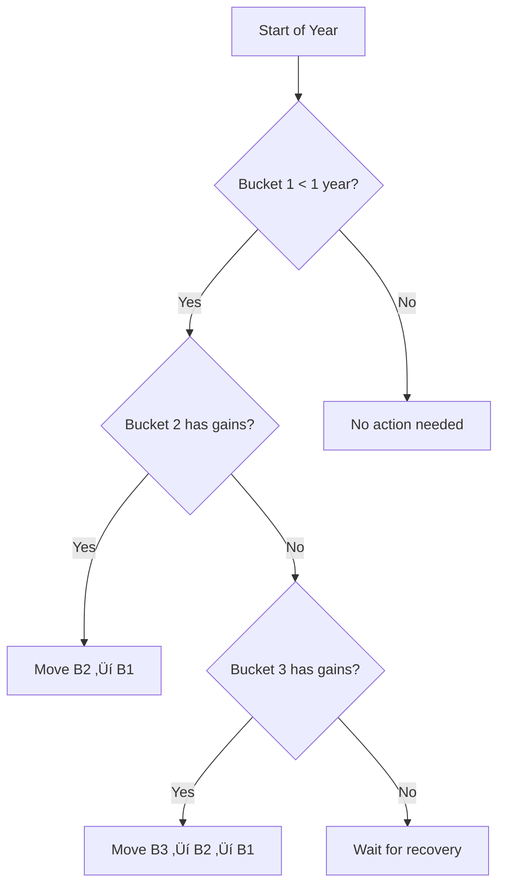

# The Three Bucket Strategy for Retirement Income

---

## The Core Problem

When you retire, you need money every month. But your investments don't give steady returns every month. Some years the market gives 20%. Some years it falls 30%.

If you withdraw money during a bad year, you sell at a loss. Do this enough times, and your corpus dies early.

This is called **sequence of returns risk**.

---

## The Solution: Separate Money by Time Horizon

Instead of one big corpus, split your money into three buckets based on when you need it:

| Bucket   | When You Need It | What It Does            |
| -------- | ---------------- | ----------------------- |
| Bucket 1 | Now (0-3 years)  | Pay your bills          |
| Bucket 2 | Soon (3-7 years) | Refill Bucket 1         |
| Bucket 3 | Later (7+ years) | Grow and beat inflation |


---

## How Much Do You Need?

Use this formula:

```
Corpus = Monthly Income × 12 × 17.5
```

The multiplier 17.5 is called the **Income Stability Ratio (ISR)**. It comes from studying 10-year rolling market data.

### Examples

| Monthly Income | Annual Need | Corpus (× 17.5) |
| -------------- | ----------- | --------------- |
| ₹50,000        | ₹6 Lakhs    | ₹1.05 Crore     |
| ₹1,00,000      | ₹12 Lakhs   | ₹2.10 Crore     |
| ₹2,00,000      | ₹24 Lakhs   | ₹4.20 Crore     |

---

## The Three Buckets Explained

### Bucket 1: Stability (33% of corpus)

**Purpose:** Pay expenses for the next 3 years, no matter what markets do.

**Investments:** Liquid funds, money market funds, short-term debt, FDs.

**Expected return:** 6-7%

**Rule:** Never runs out. Gets refilled from Bucket 2.

---

### Bucket 2: Income (33% of corpus)

**Purpose:** Generate stable returns. Refill Bucket 1 every year.

**Investments:** Equity savings funds, conservative hybrid, balanced advantage funds.

**Expected return:** 8-10%

**Rule:** Low volatility is key. This is your shock absorber.

---

### Bucket 3: Growth (33% of corpus)

**Purpose:** Beat inflation. Refill Bucket 2 every few years.

**Investments:** Flexi cap, mid cap, index funds.

**Expected return:** 12-15%

**Rule:** Never touch during a crash. Let it recover first.

---

## How Money Flows

```mermaid
flowchart TB
    subgraph GOOD["GOOD YEARS"]
        G3["Bucket 3<br/>Growth"] --harvest gains--> G2["Bucket 2<br/>Income"]
        G2["Bucket 2<br/>Income"] --move returns--> G1["Bucket 1<br/>Stability"]

    end
    
    subgraph BAD["BAD YEARS"]
        B3["Bucket 3: Don't sell"]
        B2["Bucket 2: Don't sell"]
        B1["Bucket 1: Keep withdrawing"]
    end
    G1 --> W1["💰 Withdrawals Continue"]
    B1 --> W2["💰 Withdrawals Continue"]
```




### The Core Principle

```mermaid
flowchart TB
    subgraph GOOD["☀️ GOOD YEARS - Market Up"]
        direction LR
        G3["BUCKET 3<br/>Growth"] -->|"Harvest gains"| G2["BUCKET 2<br/>Income"]
        G2 -->|"Move returns"| G1["BUCKET 1<br/>Stability"]
    end
    
    subgraph BAD["❄️ BAD YEARS - Market Down"]
        direction LR
        B3["BUCKET 3<br/>❌ DON'T SELL"] -.->|"Wait"| B2["BUCKET 2<br/>❌ DON'T SELL"]
        B1["BUCKET 1<br/>✓ Continue withdrawals"]
    end
    
    G1 --> W1["💰 Withdrawals Continue"]
    B1 --> W2["💰 Withdrawals Continue"]
```



**Good years:** Harvest gains from higher buckets, move down.

**Bad years:** Don't sell. Bucket 1 has 3 years of buffer. Wait for recovery.

---

## When to Move Money

| Trigger                    | Action                    |
| -------------------------- | ------------------------- |
| Bucket 1 < 1 year expenses | Refill from Bucket 2      |
| Bucket 2 < 3 years runway  | Refill from Bucket 3      |
| Bucket 3 up >15% in a year | Harvest gains to Bucket 2 |
| Market crash               | Do nothing. Wait.         |



---

## 15-Year Simulation

₹3.5 Cr corpus, ₹50L annual withdrawal:

```
YEAR    BUCKET 1        BUCKET 2        BUCKET 3        TOTAL       EMI PAID
────────────────────────────────────────────────────────────────────────────
  0     ₹1.20 Cr        ₹1.20 Cr        ₹1.10 Cr       ₹3.50 Cr      ₹0
        [████████]      [████████]      [███████]
        
  1     ₹0.75 Cr        ₹1.30 Cr        ₹1.25 Cr       ₹3.30 Cr      ₹50L
        [█████]         [████████]      [████████]
        ▲ spent ₹50L    ▲ grew 8%       ▲ grew 14%
        
  2     ₹0.30 Cr        ₹1.40 Cr        ₹1.43 Cr       ₹3.13 Cr      ₹1.0 Cr
        [██]            [█████████]     [█████████]
        ▲ running low
        
  3     ₹0.90 Cr ◄──────₹1.00 Cr        ₹1.63 Cr       ₹3.53 Cr      ₹1.5 Cr
        [██████]  REFILL [██████]       [██████████]
        
  5     ₹0.40 Cr        ₹1.20 Cr ◄──────₹1.50 Cr       ₹3.10 Cr      ₹2.5 Cr
        [███]           [████████]REFILL[█████████]
        
  7     ₹0.85 Cr ◄──────₹0.95 Cr        ₹1.80 Cr       ₹3.60 Cr      ₹3.5 Cr
        [█████]  REFILL [██████]        [███████████]
        
 10     ₹0.50 Cr        ₹0.80 Cr        ₹1.90 Cr       ₹3.20 Cr      ₹5.0 Cr
        [███]           [█████]         [████████████]
        
 15     ₹0.20 Cr        ₹0.30 Cr        ₹0.40 Cr       ₹0.90 Cr      ₹7.5 Cr
        [█]             [██]            [██]           DONE
```

**Result:** ₹7.5 Cr paid out. ₹90L still remaining.

---

## How Long Money Sits in Each Bucket

| Bucket   | Duration    | Why                   |
| -------- | ----------- | --------------------- |
| Bucket 1 | 1-3 years   | Gets spent monthly    |
| Bucket 2 | 3-7 years   | Waits to refill B1    |
| Bucket 3 | 7-15+ years | Grows until harvested |


---

## Crash Test: March 2020

What happens when markets fall 35%?

| Date     | Bucket 1 | Bucket 2 | Bucket 3 | Action             |
| -------- | -------- | -------- | -------- | ------------------ |
| Jan 2020 | ₹1.20 Cr | ₹1.20 Cr | ₹1.10 Cr | Normal             |
| Mar 2020 | ₹1.15 Cr | ₹1.00 Cr | ₹0.72 Cr | Crash. Don't sell. |
| Dec 2020 | ₹0.70 Cr | ₹1.20 Cr | ₹1.10 Cr | Recovered.         |
| Mar 2021 | ₹0.65 Cr | ₹1.30 Cr | ₹1.30 Cr | Harvest B3 gains.  |

You never sold at the bottom. Bucket 1 had enough buffer to wait.

---

## Inflation Handling

Withdrawals increase 6% yearly:

| Year | Monthly Withdrawal |
| ---- | ------------------ |
| 1    | ₹1,00,000          |
| 5    | ₹1,26,248          |
| 10   | ₹1,68,948          |
| 20   | ₹3,02,560          |

Bucket 3 (equity) grows faster than 6%. It funds the increasing withdrawals.

---

## Investment Options

### Bucket 1 (Stability)

**India:** HDFC Liquid, ICICI Money Market, Axis Short Term, Bank FD

**US:** SGOV, VGSH, Money Market (SPAXX), T-Bills

---

### Bucket 2 (Income)

**India:** ICICI Equity Savings, HDFC Balanced Advantage, ICICI Multi-Asset

**US:** SCHD, VBIAX, JEPI, AOK

---

### Bucket 3 (Growth)

**India:** Parag Parikh Flexi Cap, Mirae Large & Midcap, UTI Nifty 50 Index

**US:** VTI, VOO, QQQ, VGT

---

## Summary

1. **Split corpus into 3 buckets** by time horizon
2. **Bucket 1** pays bills (3 years buffer)
3. **Bucket 2** refills Bucket 1 (stable returns)
4. **Bucket 3** beats inflation (long-term growth)
5. **Never sell Bucket 3 during crashes**
6. **Harvest gains in good years**, move down the chain

The system protects you from selling at the wrong time.

---

## Quick Reference

**Corpus formula:**
```
Monthly Income × 12 × 17.5 = Required Corpus
```

**Allocation:**
```
Bucket 1: 33% (Debt)
Bucket 2: 33% (Hybrid)
Bucket 3: 33% (Equity)
```

**Refill rules:**
```
B2 → B1: Every 1-2 years
B3 → B2: Every 3-5 years
During crash: Do nothing
```

---

*This is an educational article. Consult a financial advisor before investing.*
